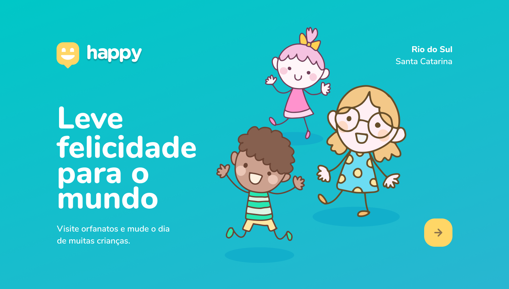

<p align="center">
  
</p>

<p align="center">
    <a href="#-description">Description</a>&nbsp;&nbsp;&nbsp;|&nbsp;&nbsp;&nbsp;
    <a href="#-technologies">Technologies</a>&nbsp;&nbsp;&nbsp;|&nbsp;&nbsp;&nbsp;
    <a href="#-getting-started">Getting started</a>&nbsp;&nbsp;&nbsp;|&nbsp;&nbsp;&nbsp;
    <a href="#-preview">Preview</a>&nbsp;&nbsp;&nbsp;|&nbsp;&nbsp;&nbsp;
</p>


## Description
Next level week, third edition, made by the Rocketseat, is an intensive week where are studied some concepts about web development. For this edition, it was done a "happy" application, this app help people to find orphanages close to them, with a finality to encourage people to visit, share and create special moments with the children.
Some business rules for the Happy app are: 
- Locate orphanages on a map.
- View information about the orphanage.
- Register new orphanage.

<p align="center">
  
</p>

<p align="center">
  &nbsp;&nbsp;
  
</p>

## Technologies
- Nodejs.
- Express.
- Html.
- Javascript.
- CSS.
- SQLite.
- Handlebars.

## Getting started
Clone the project and access in the folder "happy"
```bash
$ git clone https://github.com/georginarojas/NLW-3.git
$ cd happy/
```
Follow the steps below
```bash
# Install the dependencies
$ yarn install or npm install
$ npm install -g nodemon

# Start the project
$ yarn start or npm run start

Open http://localhost:5500 to view the app in the browser.
```

---
<p align="center">Developed by Georgina Rojas :hearts:</p>
